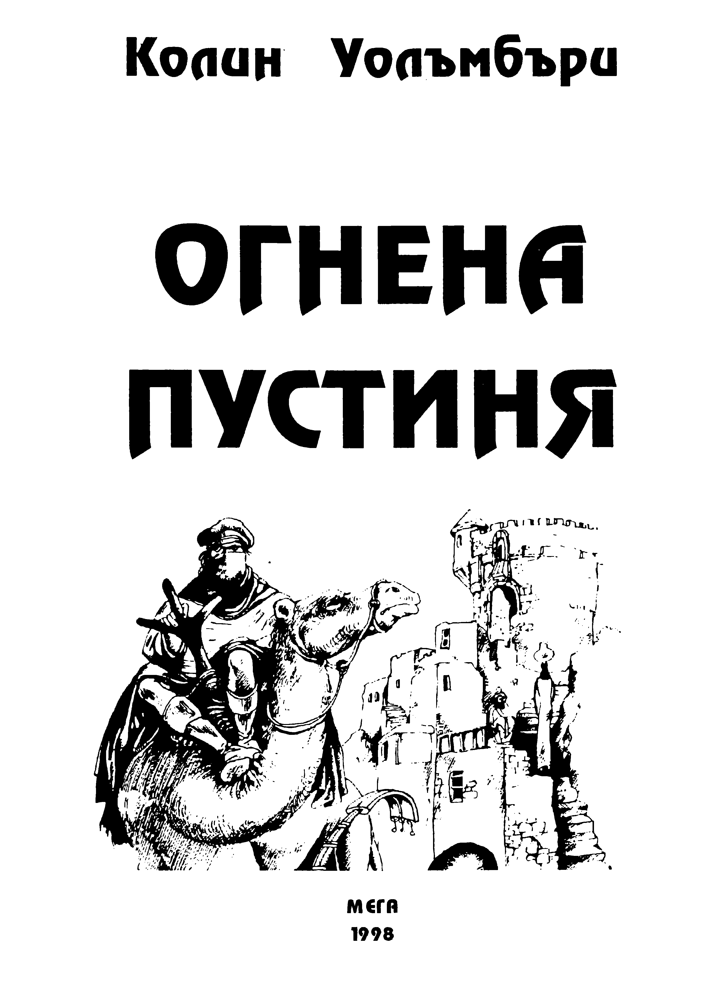

 | 

Здравей, незнайни храбрецо! Знай, че с разгръщането на тази
книга се впускаш в приключение, което ще изисква от теб да
напрегнеш сили и съобразителност, за да изпълниш една
опасна мисия. Не мисли, че авторът ще описва приключенията, а
за теб ще остава само да четеш. Напротив! Всеки твой избор,
всяко решение ще влияе върху събитията и четенето може да
завърши както с победа за теб, така и с гибел. Защото
истинският автор на книгата и нейният истински герой

ТОВА СИ ТИ!

Но кой си ти всъщност?

# ОПАСНОТО ПРЕДЛОЖЕНИЕ
Днес е почивен ден и ти с удоволствие се излежаваш на припек край
колибата си сред Старата гора. Приятно е да знаеш, че работата може
да почака. Пък и нямаш кой знае колко работа. Животът ти тук е
спокоен и най-често монотонен.

Шум от стъпки те кара да надигнеш глава. В следващия миг скачаш
на крака и с изненада се вглеждаш към пътеката в края на поляната.
От гората излиза прегърбен старец с дълга бяла дреха, който се
подпира на полиран дървен жезъл. Сбръчканото му лице е
добродушно, но в дълбоко хлътналите очи се крие тревога. От
удивление ти даже забравяш да го поздравиш. Та това е великият
вълшебник Сиян! Самият Сиян е решил да ти дойде на гости! И по
всичко изглежда, че се кани да обсъди с теб някакъв сериозен въпрос.

\- Здравей, младежо - раздава се гласът му, учудващо мощен за
крехкото старческо тяло.

Смутено промърморваш някакво приветствие, но Сиян махва с ръка.

\- Остави любезностите! Трябва да поговорим.

Докато сядате на тревата, вълшебникът изпитателно се вглежда в
лицето ти.

\- Безделието не ти се отразява добре - лукаво казва той. - На твоята
възраст човек се нуждае от приключения.

\- Аз съм само един мирен дървар - възразяваш ти. - Приключенията
са за странстващите рицари. Предпочитам да си живея мирно и тихо.

\- Не се прави на скромен! - прекъсва те старецът. - За
странстващите рицари, а? Позволи ми да ти кажа, младежо, че
никакъв странстващ рицар не би успял да извърши подвиг, какъвто те
чака. Нали те познавам.

\- Вероятно си прав - съгласяваш се ти. - Особено, ако се налага.
Например, ако трябва да спася Старата гора от гибел...

\- Именно това се налага! - категорично заявява Сиян. - Старата гора
е заплашена от самия Агамор. Чувал ли си това име?
Иска ли питане! От години насам в Старата гора се носят зловещи
слухове за Агамор. Никога той е бил най-способният ученик на Сиян,
ала след това е тръгнал по пътя на злото и днес е един от най-
опасните магьосници.

\- Виждам, че ме разбираш - продължава старецът. - Позволи ми сега
да ти задам един въпрос. Откога не си сънувал приятни сънища?
Странен въпрос... Напрягаш паметта си и с изненада откриваш, че
не си спомняш напоследък да си сънувал.

\- Да, така е - кимва Сиян. - От няколко седмици хората по нашия
край сънуват само кошмари или изобщо не сънуват. Приятните им
сънища са откраднати чрез магия. А само двама души на света имат
силата да сторят това - аз и Агамор.

\- Но защо са му сънищата на хората? - учудваш се ти.
Вълшебникът тъжно поклаща глава.

\- Преди години, когато изгоних Агамор оттук, той се закле, че един
ден ще се върне и ще превърне Старата гора в царство на злото.
Смятах заплахите му за празни приказки... ала сега разбирам, че съм
грешал. Знаеш ли, че една от най-страшните магии е тъкмо тази - да
се откраднат сънищата на хората? Чрез нея могат да се изтъкат
невидими черни нишки право хъм човешките души. И тогава Агамор
ще се превърне в повелител на всичко живо из нашата област. Но за
щастие все още имаме време. Черната магия на сънищата е дълга и
бавна. Ако в близките дни някой храбрец успее да открие Агамор и да
се пребори с него...

\- Мене ли имаш предвид? - възкликваш ти. - Чакай малко, аз почти
нищо не разбирам от магии и вълшебства! Защо сам не се справиш с
Агамор?

\- Мислих за това - с въздишка отвръща Сиян. - Да, канех се да тръгна
да диря Агамор и да сложа край на злодеянията му. Но ако го сторя,
ще трябва да оставя гората без защита. А все още не всички сънища
са откраднати. Трябва да стоя тук и с всички сили да преча на черната
магия. Така поне ще забавя плановете му. А в това време ти...
Старецът не довършва думите си. Гледа те право в очите и ти
разбираш, че нямаш право да откажеш. Тихата ти въздишка е
всъщност знак за съгласие. Веднага обаче ти хрумва нов въпрос.

\- Добре, да речем, че приема. Къде да търся Агамор?

\- Тъкмо това е най-трудното - неохотно признава Сиян. - Той е
прекалено опитен магьосник и е изтъкал около себе си Завесата на
Незнанието. Опитах всички вълшебства, но дори Премъдрата книга не
може да ми помогне. Чувал съм само неясни слухове, че сега Агамор
живее в някаква долина отвъд Огнената пустиня. Но къде е тази
долина и дали изобщо съществува... ще трябва да го узнаеш сам. И
тъй, мисля, че се разбрахме. Утре призори потегляш да търсиш нашия
общ враг. Знаеш ли правилата?

[Наистина, знаеш ли правилата? За всеки случай, нека ги кажем.
Чети внимателно, защото от тях зависи съдбата ти в тази книга.](rules.md)
