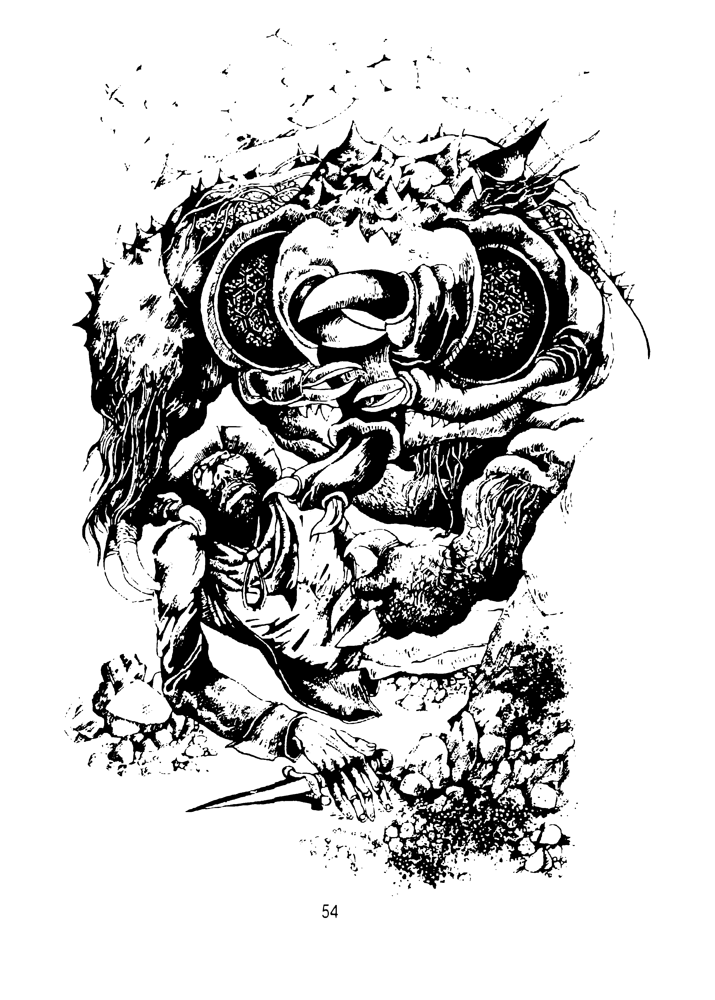

## 127.

Не се колебаеш нито секунда. Скачаш от камилата и се хвърляш към
мястото, където е потънал Пано. Но едва си успял да направиш
няколко крачки, когато опората под нозете ти изчезва. Пропадаш
надолу сред поток от пясък, който нахлува в устата и ноздрите ти.

Полузадушен се стоварваш върху пясъчна купчина и веднага скачаш
на крака. В полумрака различаваш около себе си широк тунел със
стени от слепени песъчинки. Ала нямаш време да го оглеждаш,
защото на няколко метра пред теб лежи окървавеното тяло на Пано. А
над него се извисява вледеняващо кръвта чудовище. Огромната му
ръбеста глава и осеяна с шипове и редки груби косми. Очите са
фасетъчни като на насекомо. Около назъбените криви челюсти се
гърчат дълги пипала, завършващи с криви нокти. Сега ще трябва да
го сражаваш за живота си.

С какво ще се биеш?

[С меч - продължи на 103.](./103)

[С мъртва пепел - мини на 58.](./58)

[С гръцки огън - прехвърли се на 85.](./85)
