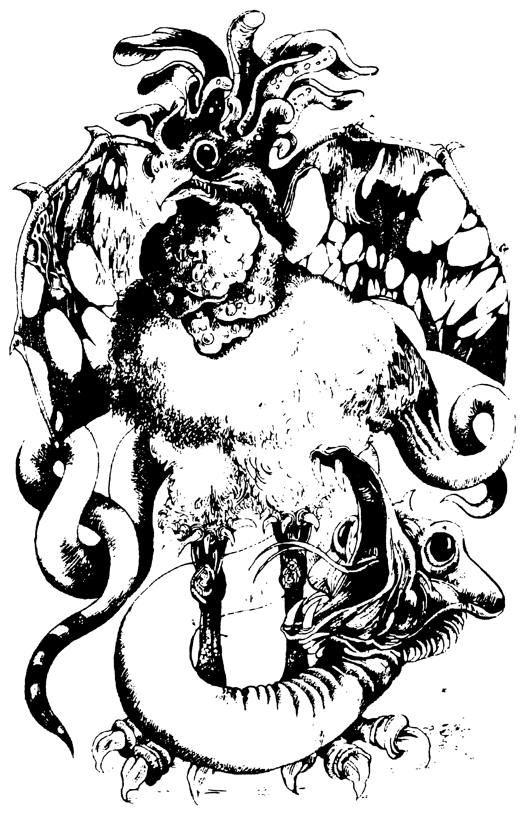

## 341.

Философски решаваш, че трябва да се примириш с неизбежното.
Така или иначе, утре те чака тежък ден, значи най-добре ще е да
отпочинеш както се полага. И без повече разсъждения се просваш на
нара, като подлагаш раницата под главата си.

На разсъмване се събуждаш бодър и отпочинал. Ако имаш нужда,
можеш да си възстановиш 3 жизнени точки.

Метален звън те кара да надигнеш глава. Един надзирател е
отключил решетката към тунела и нетърпеливо ти маха с ръка.

\- Хей. ставай! Не си губи времето в сън и без това ти остават броени
минути живот.

След тези думи той се отдръпва и изчезва през една малка вратичка
в стената на тунела.

Ставаш, препасваш меча, взимаш раницата и минаваш отвъд
решетката. Мимоходом натискаш вратичката, през които е изчезнал
пазача, но тя е заключена. Не ти остава нищо друго, освен да тръгнеш
към края на тунела. Излизаш навън и спираш за момент, заслепен от
ярката слънчева светлина. Посреща те рев на многохилядна тълпа.
Оглеждаш се през премрежени клепки и виждаш, че се намираш на
широка кръгла арена, посипана с дебел слой пясък. Обкръжават я
високи гладки стени, в които зеят отворите на още няколко тунела.
Над тях са препълнените зрителски трибуни.

Централната трибуна е украсена с килими и гоблени. На нея се
изправя един застаряващ мъж, облечен в разкошни дрехи от кадифе,
коприна и сърма.

\- Привет, чужденецо! - високо изрича той. - Приготви се да избереш
съдбата си.

Пристъпваш към трибуната. Човекът горе се навежда и хвърля пред
теб черна кожена торбичка.

\- В тази торбичка има пет костени плочки - продължава той. - На
четири от тях са изписани имената на противниците, с които ще
можеш да се сражаваш. Петата е празна. Ако изтеглиш нея, ще трябва
да се биеш и с четиримата. Хайде, направи своя избор.

Вдигаш торбичката и колебливо пъхаш ръка в нея. Опипваш
костените плочки, ала не усещаш никаква разлика. Да става каквото
ще! Решително хващаш една от тях, изваждаш и я поглеждаш.

Плочката е чиста!

\- Съдбата реши! - раздава се над тебе гласът на богато облечения
старец. - Пуснете противниците!

Ядно захвърляш проклетата плочка и обръщаш гръб на трибуната.
От тунелите бавно излизат четиримата ти противници.

Най-отпред със скърцане крачи трол - каменен великан, висок три
човешки ръста. След него тромаво върви грамаден люспест дракон, от
чиято полуотворена паст излизат дим и пламъци. Третият противник е
дълга отровна змия. И на последно място се появява странно
същество с тяло на петел, змийска опашка и криле на прилеп. Това е
легендарният василиск, който може да вкаменява с поглед!

Дъхът ти спира пред тази страховита четворка. Боят наистина ще
бъде на живот и смърт. Не забравяй, че ако имаш бързоходни ботуши,
с тяхна помощ ще можеш да нанасяш по два удара за всеки удар на
врага. 

А сега избери срещу кого ще се биеш най-напред.

[Срещу трола - прехвърли се на 308.](./308)

[Срещу змията - мини на 260.](./260)

[Срещу дракона - попадаш на 317.](./317)

[Срещу василиска - продължи на 92.](./92)

[Ако искаш да използваш дим на миражите, мини на 372.](./372)
