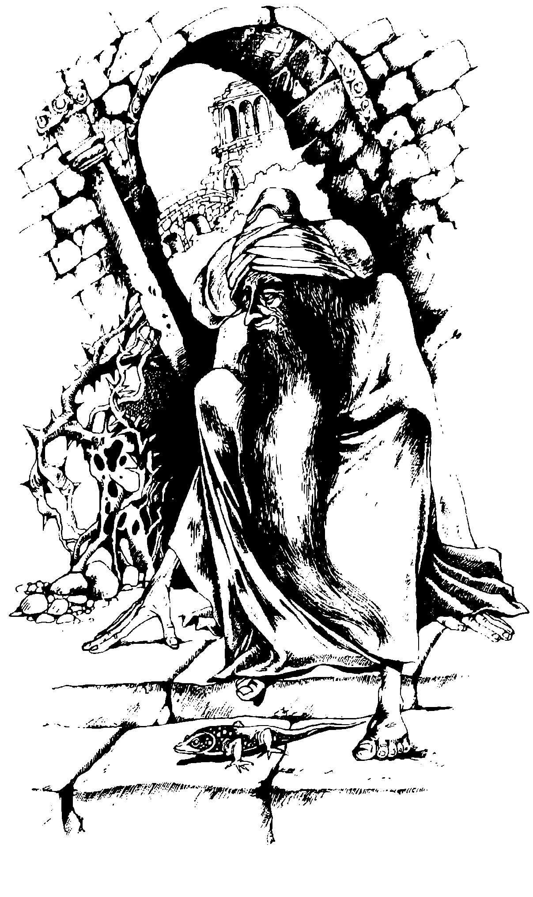

## 405.

Призори на следващия ден тръгваш пеш към източния край на
оазиса. Древните мраморни развалини те посрещат с тишина и покой.
Едва забележима пътечка води покрай обрасли с бръшлян колони към
буренясало вътрешно дворче. Спираш и се питаш накъде да
продължиш сега.

\- Добър ден, храбрецо - стресва те нечий тих глас.

Изненадано надигаш глава. Вдясно от тебе широки каменни стъпала
се изкачват към полуразрушен портал, пред който е седнал съсухрен
старец с дълга бяла брада.

\- Добър ден - отвръщаш ти. - Искам да питам...

Старецът се усмихва добродушно и поклаща глава.

\- Знам какво искаш да питаш. Срещу опасен враг си тръгнал млади
момко. Уви, малко мога да ти разкрия. Агамор е могъщ и опитен
магьосник. Той умее да хвърля над делата си непроницаемо було, 
през което и най-надареният ясновидец съзира
само смътни сенки. Едно знам със сигурност - къде ще го намериш.
Там, където пътят на керваните достига подножието на
Полумесечните планини и завива към Киман, се крие мрачна клисура.
Отвъд нея е дворецът на Агамор.

Гласът на стария ясновидец затихва. Решаваш, че е казал всичко,
което знае, и се готвиш да тръгнеш обратно, когато той рязко се
изправя.

\- Почакай! Виждам още нещо. Ако тръгнеш от оазиса към Перодон,
скоро ще видиш разрушена крепост. Никой не смее да ходи натам,
защото сред старите камъни се спотайват зли духове. Но ако влезеш в
крепостта, може би ще откриеш нещо, което да ти помогне в борбата
против Агамор. Това е всичко. Сбогом, храбрецо... и на добър час.

Замислено се връщаш към къщурката на Сахим.

Какво ще предприемеш сега?

[Ако решиш да тръгнеш към разрушената крепост, мини на 322.](./322)

[Ако не желаеш да я посетиш, прехвърли се на 269.](./269)
