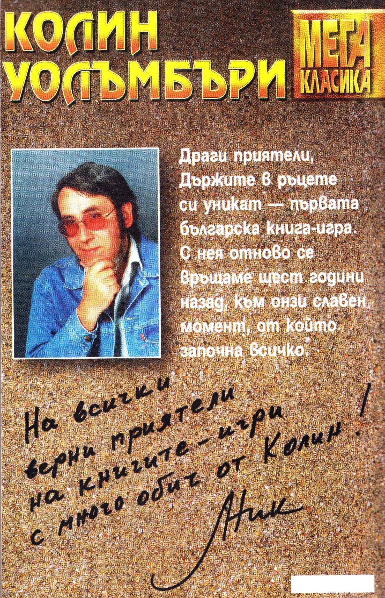
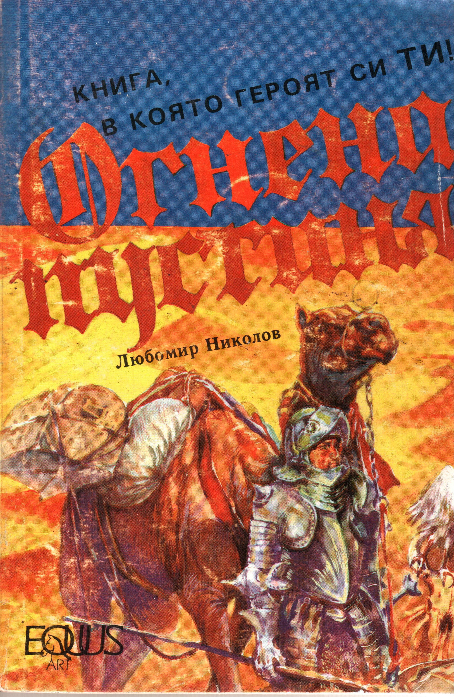

## 420.

Стоиш замаян сред черните мраморни стени и още не можеш да
повярваш, че всичко е свършило. Агамор, страшният магьосник Агамор
е победен! След толкова изпитания, след загубата на верните ти
спътници Пано и Борил, най-после си постигнал целта.

Остава ти още една задача. Обръщаш се към светещата плетеница и
с мощни удари на меча разбиваш стъклените тръби. С оглушителен
звън цялото съоръжение рухва на пода. Пулсиращите светлинки
излитат отвътре, събират се на разноцветно ято и устремно се
понасят през отворения прозорец. Виждаш ги как се издигат над
планините, за да се върнат към далечната Стара гора.

Натам е и твоят път, победителю!

**КРАЙ**

